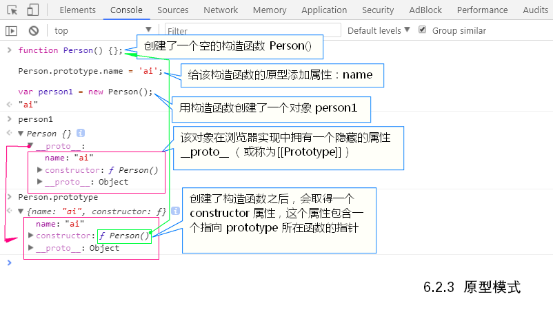

# 面向对象的程序设计

## 对象·Object

ES中没有类的概念，因此它的对象也与基于类的语言中的对象有所不同。ES对于对象的定义为：“无序属性的集合，其属性可以包含基本值、对象或者函数”。

对象的每个属性或方法都有一个名字，而每个名字都映射到一个值。无非就是一组名值对，其中值可以是数据或函数。

### 附加：对象有哪些性质？

对象具有 继承、封装、多态 等特性。

* 继承：子类继承父类的属性和方法
* 封装：对象可以把基本属性值和方法封装起来
* 多态：对象存在多种形态，对象可以重载和重写
    * 重载：方法名相同，参数不同（备注：JavaScript语言没有重载）
    * 重写：子类重写父类的方法

```js
// 访问器属性
var obj = {
    _year: 2017,
    edition: 1
}
Object.defineProperty(obj, "year", {
    get: function () {
        return this._year
    },
    set: function (newValue) {
        if (newValue > 2018) {
            this._year = newValue;
            this.edition += newValue - 2018;
        }
    }
})

obj.year = 2019;
console.log(obj.year);  // 2019
```

## 创建对象

### 单例模式：

使用变量字面量、或Object构造函数方式创建的对象。

```js
var obj = {
    name: 'dirfting mirai',
    age: '20'
}
```

### 工厂模式：

```js
function createObj(name, age) {
    var obj = new Object();
    obj.name = name;
    obj.age = age;
    return obj;
}

var obj = createObj('dirfting mirai', 20);

console.log(obj)    // ​​​​​{ name: 'dirfting mirai', age: 20 }​​​​​
```

### 构造函数模式

```js
function People(name, age) {
    this.name = name;
    this.age = age;
}

var people1 = new People('dirfting mirai', 20);
console.log(people1.constructor == People)  // true
console.log(people1 instanceof People)  // true


// 任何函数，只要通过 new 操作符来调用，那它就可以作为构造函数，如果不通过 new 操作符来调用，那它跟普通函数也不会有什么两样。

People('Quokka JavaScript', 111);
var Global = function () {
    return this;
}();
console.log(Global.age);    // 111

var obj = {};

People.call(obj, 'Time Reverse', 0);

console.log(obj.name, obj.age); // Time Reverse 0
```

#### 构造函数的问题

```js
function Person(name, age, job){
    this.name = name;
    this.age = age;
    this.job = job;
    this.sayName = function(){  // 注意此行
        alert(this.name);
    };
}
```

使用构造函数的主要问题，就是每个方法都要在每个实例上重新创建一遍。
以这种方式创建函数，会导致不同的作用域链和标识符解析，但创建 Function 新实例的机制仍然是相同的。因此，不同实例上的同名函数是不相等的

```js
alert(person1.sayName == person2.sayName);  //false
```

通过把函数定义转移到构造函数外部来解决这个问题。

```js
function Person(name, age, job) {
    this.name = name;
    this.age = age;
    this.job = job;
    this.sayName = sayName;
}
function sayName() {
    alert(this.name);
}
```

如果对象需要定义很多方法，那么就要定义很多个全局函数，于是我们这个自定义的引用类型就丝毫没有封装性可言了。好在，这些问题可以通过使用原型模式来解决。

### 原型模式

我们创建的每个函数都有一个 prototype（原型）属性，这个属性是一个指针，指向一个对象，
而这个对象的用途是包含可以由特定类型的所有实例共享的属性和方法。如果按照字面意思来理解，那
么 prototype 就是通过调用构造函数而创建的那个对象实例的原型对象。
使用原型对象的好处是可以让所有对象实例共享它所包含的属性和方法。

```js
function Person(){};

Person.prototype.name = 'Drifting Mirai';
Person.prototype.age = 20;
Person.prototype.sayName = function(){
    console.log(this.name);
}

var person1 = new Person();
var person2 = new Person();

person1.sayName();  // ​​​​​Drifting Mirai

console.log(person1.sayName == person2.sayName) // true
```

原型最初只包含 constructor 属性
新对象的这些属性和方法是由所有实例共享的。

```js
function Person() {};

Person.prototype.name = 'ai';

var person1 = new Person();

console.log(typeof person1);    // object
console.log(person1 instanceof Person); // true
console.log(person1.name);  // ai
console.log(person1.constructor)    // [λ: Person]
console.log(Person.prototype)   // ​​​​​Person { name: 'ai' }​​​​​
```



Person.prototype 指向了原型对象，而 Person.prototype.constructor 又指回了 Person。

可以通过 isPrototypeOf()方法来确定对象之间是否存在这种关系。从本质上讲，如果[[Prototype]]指向调用 isPrototypeOf()方法的对象（Person.prototype），那么这个方法就返回 true，如下所示：

ECMAScript  5 增加了一个新方法，叫 Object.getPrototypeOf()，使用 Object.getPrototypeOf() 可以方便地取得一个对象的原型

```js
console.log(Person.prototype.isPrototypeOf(person1));   // true
console.log(Object.getPrototypeOf(person1) == Person.prototype) // true
```

虽然可以通过对象实例访问保存在原型中的值，但却不能通过对象实例重写原型中的值。如果我们
在实例中添加了一个属性，而该属性与实例原型中的一个属性同名，那我们就在实例中创建该属性，该
属性将会屏蔽原型中的那个属性。

```js
function Person() {};
Person.prototype.name = 'ai';
var person1 = new Person();
var person2 = new Person();

person1.name = 'kizuna';

// 当为对象实例添加一个属性时，这个属性就会屏蔽原型对象中保存的同名属性
console.log(person1.name);  // kizuna
console.log(person1.constructor.prototype.name) // ai
console.log(person2.name)   // ai

// 使用 hasOwnProperty()方法可以检测一个属性是存在于实例中，还是存在于原型中。
console.log(person1.hasOwnProperty('name'));  // true, name来自实例
console.log(person2.hasOwnProperty('name'));  // false, name来自原型

// 使用 delete 操作符则可以完全删除实例属性，从而让我们能够重新访问原型中的属性
delete person1.name;
console.log(person1.name);  // ai
console.log(person1.hasOwnProperty('name'));  // false, name来自原型

console.log(Object.getOwnPropertyDescriptor(person1, 'name'));
/*
​​​​​{ value: 'kizuna',​​​​​
​​​​​  writable: true,​​​​​
​​​​​  enumerable: true,​​​​​
​​​​​  configurable: true }​​​​​
*/
```

有两种方式使用 in 操作符：单独使用和在 for-in 循环中使用。在单独使用时，in 操作符会在通
过对象能够访问给定属性时返回 true，无论该属性存在于实例中还是原型中。

```js
function Person() {};
Person.prototype.name = 'ai';
Person.prototype.age = 18;
Person.prototype.say = function say() {
    console.log('Hello world');
}

var person1 = new Person();
var person2 = new Person();

person1.name = 'kizuna';

console.log(person1.hasOwnProperty('name')) // true
console.log(person2.hasOwnProperty('name')) // false
console.log('name' in person1); // true
console.log('name' in person2); // true

// 要取得对象上所有可枚举的实例属性，可以使用 ECMAScript 5 的 Object.keys()方法，返回一个数组。
var keys = Object.keys(Person.prototype);
console.log(keys);  // ​​​​​[ 'name', 'age', 'say' ]​​​​​

var p1Keys = Object.keys(person1);
console.log(p1Keys);    // ​​​​​[ 'name', 'age' ]​​​​​

// 想要得到所有实例属性，无论它是否**可枚举**，都可以使用 Object.getOwnPropertyNames()方法。
var p1AllKeys = Object.getOwnPropertyNames(Person.prototype);
console.log(p1AllKeys); // ​​​​​[ 'constructor', 'name', 'age', 'say' ]​​​​​
```

### 更简单的原型语法

```js
function Person(){};
Person.prototype = {
    name: 'ai',
    age: 18,
    say: function () {
        console.log('Hello world');
    }
}

var person1 = new Person();
console.log(person1.constructor)    // Object
```

不过这个语法有一个例外：constructor 属性不再指向 Person 了，而指向 Object。

```js
function Person(){};
Person.prototype = {
    constructor: Person,
    name: 'ai',
    age: 18,
    say: function () {
        console.log('Hello world');
    }
}

var person1 = new Person();
console.log(person1.constructor)    // Person
```

#### 原型的动态性

在原型中查找值是一次搜索，因此对原型对象做的任何修改都可以立即从实例上反应出来，即使是先创建了实例后修改原型也是如此。

当我们调用实例中的某个方法（属性）时，首先会在实例中搜索，在没有找到的情况下，会继续搜索原型。实例中的指针仅指向原型，而不指向构造函数。

```js
function Person() {};
var friend = new Person();
Person.prototype.name = 'ai';
console.log(friend.name);   // ai
```

重写原型对象切断了现有原型与任何之前已经存在的对象实例之间的联系；它们引用的仍然是最初的原型。

```js
function Person() {};
var friend = new Person();
Person.prototype = {
    constructor: Person,
    name: 'ai'
}
console.log(friend.name); // undefineed
```

通过原生对象的原型，不仅可以取得所有默认方法的引用，**而且也可以定义新方法**。可以像修改自定义对象的原型一样**修改原生对象的原型**，因此可以随时添加方法。

```js
String.prototype.startsWith = function(str){
    console.log('重写的startsWith函数');
    return this.indexOf(str) == 0;
};

var str = 'Hello world!';
console.log(str.startsWith('Hello'));   // 重写的startsWith函数 true
```

但我们不推荐在产品化的程序中修改/添加原生对象的原型函数，因为这样可能导致命名冲突。

#### 原型对象的问题

原型模式省略了为构造函数传递初始化参数这样环节，结果所有实例默认情况下都将取得相同的属性值。
但最大的问题是：原型模式的共享性本质，对于引用类型，看下面的例子：

```js
function Person() {};
Person.prototype = {
    constructor: Person,
    name: 'Xiaomi',
    age: 8,
    friends:['Apple','Google'],
    printFriends: function(){
        console.log(this.friends);
    }
};
var person1 = new Person();
var person2 = new Person();
person1.friends.push('Huawei');
person1.printFriends();     // ​​​​​[ 'Apple', 'Google', 'Huawei' ]​​​​​
person2.printFriends();     // ​​​​​[ 'Apple', 'Google', 'Huawei' ]​​​​​
console.log(person1.friends == person2.friends);    // true
```

而这个问题正是我们很少看到有人单独使用原型模式的原因所在。

而使用构造函数模式/工厂模式不会有这种问题。

```js
function Person() {
    this.name = 'Xiaomi';
    this.age = 8;
    this.friends = ['Apple', 'Google'];
    this.printFriends = function () {
        console.log(this.friends);
    };
}

var person1 = new Person();
var person2 = new Person();

person1.friends.push('Huawei');

person1.printFriends(); // ​​​​​[ 'Apple', 'Google', 'Huawei' ]​​​​​
person2.printFriends(); // ​​​​​[ 'Apple', 'Google' ]​​​​​
```

#### 组合使用构造函数模式和原型模式

组合使用构造函数模式与原型模式。构造函数模式用于定义实例属性，而原型模式用于定义方法和共享的属性。
每个实例都会有自己的一份实例属性的副本，但同时又共享着对方法的引用，最大限度地节省了内存。另外，这种混成模式还支持向构造函数传递参数；可谓是集两种模式之长。

这种构造函数与原型混成的模式，是目前在 ECMAScript 中使用最广泛、认同度最高的一种创建自
定义类型的方法。可以说，这是用来定义引用类型的一种默认模式。

```js
function Person(name, age) {
    this.name = name;
    this.age = age;
    this.friends = ['Apple', 'Google'];
}

Person.prototype = {
    constructor: Person,
    printFriends: function () {
        console.log(this.friends);
    }
}

var person1 = new Person('Xiaomi',8);
var person2 = new Person('Smarts',8);

person1.friends.push('Huawei');

person1.printFriends(); // ​​​​​[ 'Apple', 'Google', 'Huawei' ]​​​​​
person2.printFriends(); // ​​​​​[ 'Apple', 'Google' ]​​​​​

console.log(person1.friends == person2.friends);  // false
console.log(person1.printFriends == person2.printFriends);  // true
```

#### 动态原型模式

动态原型模式，它把所有信息都封装在了构造函数中

```js
function Person(name, age) {
    this.name = name;
    this.age = age;
    // 不必用一大堆 if 语句检查每个属性和每个方法；只要检查其中一个即可。
    if ((typeof this.sayName) != 'function') {
        // 这里只在 sayName()方法不存在的情况下，才会将它添加到原型中。这段代码只会在初次调用构造函数时才会执行。
        Person.prototype.sayName = function () {
            console.log(this.name);
        }
    }
}
var person1 = new Person('ai', 18);
person1.sayName();
console.log(person1.constructor);   // Person
```

## 继承

